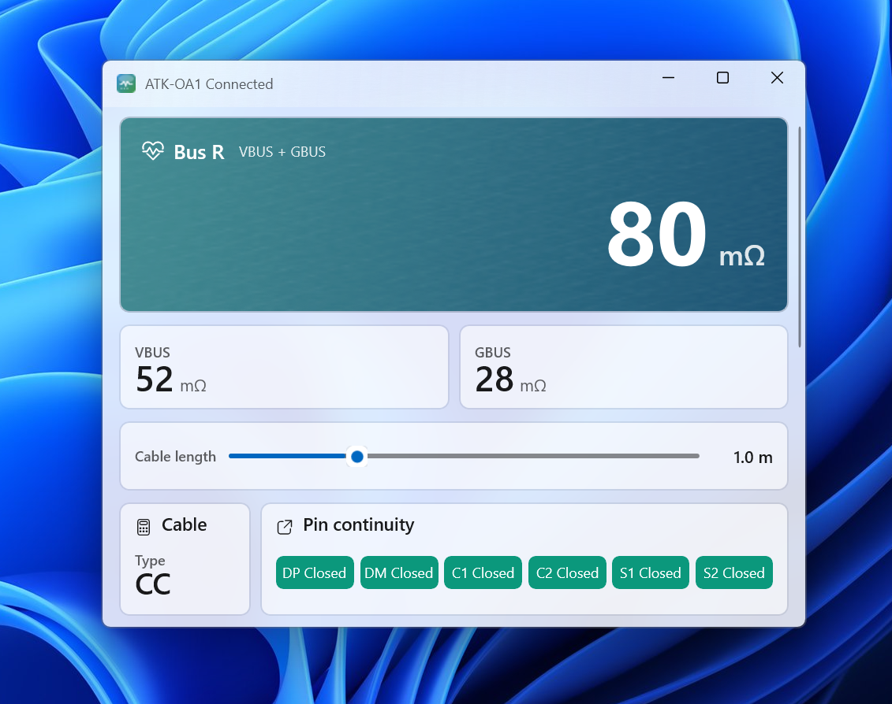
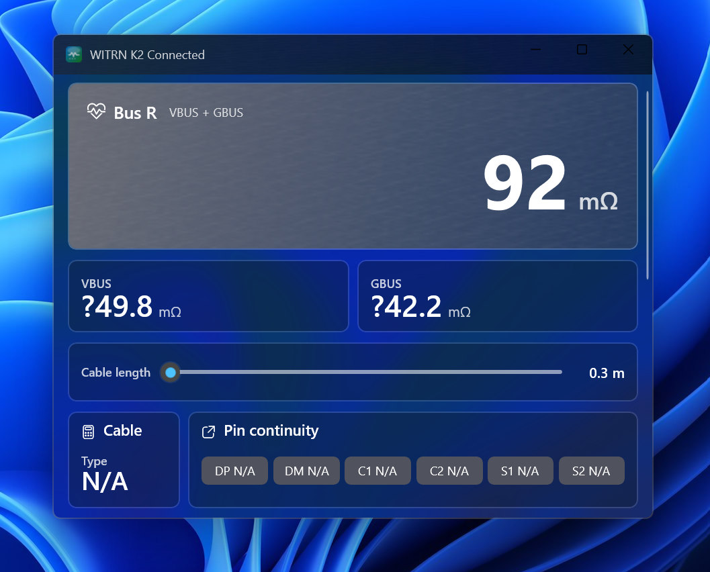

# LineResistanceHost_WinUI

LineResistanceHost_WinUI is a Windows WinUI 3 host application for USB HID cable and bus resistance measurement.

The app currently supports:

- ATK-OA1 HID cable resistance and pin continuity reports.
- WITRN K2 HID metrics reports, VID `0x0716`, PID `0x5060`.
- Automatic HID discovery and connection.
- Light and dark Fluent-style UI.
- Simplified Chinese, Traditional Chinese, and English UI text.

## Screenshots

### ATK-OA1 Light Mode

ATK-OA1 connected in light mode, showing total bus resistance, separated VBUS/GBUS values, cable type, and pin continuity.



### WITRN K2 Dark Mode

WITRN K2 connected in dark mode. K2 reports total bus resistance directly from HID metrics; the separated `?VBUS` and `?GBUS` values are empirical estimates and are marked with a leading question mark in the UI.



## K2 Calculation Note

For WITRN K2, the HID metrics report exposes current `I(A)`, `D+(V)`, and `D-(V)`.

The total bus resistance is calculated as:

```text
R_total_mOhm = (D+ - D-) / I * 1000
```

The separated VBUS/VCC and GBUS/GND values are empirical estimates derived from calibration points. They are shown with a leading `?` in the UI because they are not raw split values directly reported by K2 HID.

## Build

Requirements:

- Windows 10 1809 or newer
- .NET SDK 10
- Windows App SDK / WinUI 3 toolchain

Build the app:

```powershell
dotnet build .\LineResistanceHost\LineResistanceHost_WinUI.csproj -c Debug -p:Platform=x64
```

The generated startup executable is named:

```text
LineResistanceHost_WinUI.exe
```

## Release Package

To create slim x64 and ARM64 release packages:

```powershell
.\package-slim-release.ps1
```

## Attribution

This project was reconstructed as a local WinUI host from behavior observed in the public web tool at:

https://oa1.ruaorz.com/

This project is not affiliated with, endorsed by, or sponsored by any hardware vendor.

